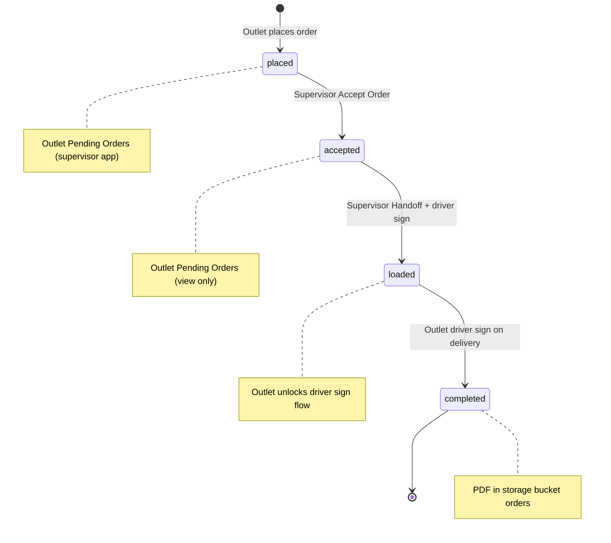

# Android orders apps — build specification

Authoritative spec for implementing the **outlet** and **supervisor** Android apps. Use this document when building or refactoring; it supersedes informal notes in chat.

**Related:** [android-pos-deduction-requirements.md](./android-pos-deduction-requirements.md) (stock / POS deductions after delivery).

---

## Apps overview

| App | Package (proposed) | Users | Auth |
|-----|-------------------|-------|------|
| **Afterten Orders** | `com.afterten.ordersapp` | Outlet branch staff | Email + password per outlet |
| **Afterten Supervisor** | `com.afterten.supervisorapp` (new module) | Hub supervisors | Email + password (supervisor role) |

Both apps share **`Shared`** for Supabase, models, PDF, signature pad, and cart logic where possible.

---

## Order status lifecycle



| Status | Set by | Who can see / act |
|--------|--------|-------------------|
| `placed` | Outlet — Place order | Supervisor: **Pending Orders** (edit qty, Accept) |
| `accepted` | Supervisor — Accept order | Outlet: **Pending Orders** (read-only) |
| `loaded` | Supervisor — Dispatch (Handoffs) | Outlet: driver name + signature flow; banner “Order is on the way”; push notification |
| `completed` | Outlet — driver sign submit | Both apps: **Completed Orders** + PDF download |

> **Schema note:** Today Supabase may use `ordered`, `offloaded`, `delivered`. Add migration for `accepted` and `completed`, or map legacy RPCs (`mark_order_loaded`, `mark_order_offloaded`) to the statuses above. New RPCs recommended: `accept_order`, `dispatch_order`, `complete_order`.

---

## Authentication

### Outlet app (Afterten Orders)

- Each **outlet** is assigned **one email + password** (Supabase Auth user linked via `outlets.auth_user_id` or `member_outlet_ids`).
- Login screen: email, password, Log in.
- On success → **Outlet dashboard** (session holds `outlet_id`, outlet name, JWT).
- **Log out** clears session and returns to login.

### Supervisor app (Afterten Supervisor)

- Supervisors have Supabase Auth accounts with **supervisor** role (`user_roles` / `RoleGuards.Supervisor`).
- Login screen: email, password, Log in.
- On success → **Supervisor dashboard**.
- **Log out** clears session.

---

## App 1 — Afterten Orders (outlet)

### Dashboard

Layout: vertical stack, centered or full-width buttons + **Log out** (top-right or bottom).

| # | Button | Navigates to |
|---|--------|--------------|
| 1 | **Create Order** | Product catalog / cart flow |
| 2 | **Pending Orders** | List of orders with status **`accepted`** (and optionally **`loaded`** for in-transit view) |
| 3 | **Completed Orders** | List of orders with status **`completed`** |
| — | **Log out** | Login screen |

> Transfers, damages, and stocktake are **out of scope** for this dashboard spec unless added as a later phase. This dashboard is **three order buttons + logout** only.

---

### Flow A — Create Order

#### A1. Product list (catalog)

**Data:** `catalog_items` where `active = true` and `outlet_order_visible = true`. Load variants from `catalog_variants` per base item.

**Layout:** scrollable list/grid of **base items** only (one row/card per base product).

Each **base item card** (top → bottom):

1. **Base item name** (title)
2. **Base item UOM** (e.g. `each`, `case`) — from `consumption_uom` / `transfer_unit`
3. **Product image** (`image_url`)
4. **Qty controls** (only when base has **no** variants, or for base-level qty if business rules allow base + variants — default: **if item has variants, base card opens variant popup; base row qty hidden until no variants**)

**Qty control row** (below image):

- `[ − ]`  **numeric qty field**  `[ + ]`
- Min qty `0`; step sensible for UOM (integers default).

**Items with variants:**

- Base card still shows name, UOM, image.
- Tapping the card opens a **variant popup** (modal bottom sheet or dialog).
- Base-level qty field on main list is **hidden** when `has_variations = true` (variants only in popup).

**Variant popup:**

- Title: base item name.
- List of variants; each variant row (top → bottom):
  1. **Variant name**
  2. **Variant UOM**
  3. **Variant image**
  4. `[ − ]` qty field `[ + ]`
- Popup is **non-blocking for browsing**: user may dismiss popup and continue scrolling the main catalog; qty entered in popup **persists** in cart state.
- User can open multiple variant popups across different products.

**End of list:**

- Fixed or sticky **Proceed** button → navigates to **Cart summary**.

**Cart state (in memory / ViewModel):**

```kotlin
// Pseudotype
CartLine(baseItemId, variantKey?, qty, name, uom, unitCost, imageUrl)
// variantKey null or "base" for non-variant lines
```

---

#### A2. Cart summary

**Header (top):**

- Date (local)
- Time (local)
- **Outlet name**
- **Order number** — allocate on enter or after place (prefer server `next_order_number` / `place_order` return)

**Table columns:**

| Product name | Qty | UOM | Cost | Amount |

**Currency:** `K x,xxx.xx` (prefix `K`, thousands separator, 2 decimals). Example: `K 1,250.00`.

**Row rendering:**

- **No variants:** single row — base name, qty, uom, unit cost, amount = cost × qty.
- **With variants:**  
  - Row 1: **underlined base item name** (no qty on parent row optional; show subtotal in grand total only from variant lines).  
  - Following rows: bullet list style (indent) — each variant: name, qty, uom, cost, amount.

**Footer:**

- **Grand total** = sum of all line amounts.

**Actions:**

- **Sign** button → **Signature screen** (A3).

---

#### A3. Signature & place order

**Fields:**

1. **Employee name** — single text field; **force title case on first letter of each word** (First & Last capitalized) as user types or on blur.
2. **Signature pad** — finger/stylus draw only; no typed signature; clear + redraw.

**Actions:**

- **Place order** — enabled when name non-empty and signature non-empty.
- On submit:
  1. Upload signature PNG to Supabase Storage bucket **`signatures`** (path e.g. `{outlet_id}/{order_id}/employee.png`).
  2. Call **`place_order`** RPC (or insert `orders` + `order_items`) with status **`placed`**.
  3. Persist `employee_signed_name`, `employee_signature_path`, `employee_signed_at`.
  4. Navigate to dashboard or success toast; clear cart.

---

### Flow B — Pending Orders (outlet)

**Query:** `orders` where `outlet_id = session.outlet_id` and `status IN ('accepted', 'loaded')` (accepted = waiting; loaded = on the way).

**List item:**

- Order number, date, status badge.
- If status **`loaded`**: prominent text **“Order is on the way”** below the row.
- Tap → **Order detail (read-only)** for `accepted`.
- Tap → **Driver sign-off screen** for `loaded` (Flow B2).

**Push notification:**

- When order status becomes **`loaded`**, show local notification: e.g. *“Order {order_number} is on the way”* (FCM or Supabase Realtime subscription on `orders`).

---

#### B2. Loaded order — outlet driver sign-off

**Unlocked fields only** (order locked otherwise):

1. **Driver name** — manual entry; **capitalize first letter of first and last name**.
2. **Signature pad** — driver signs with finger on **outlet phone**.

**Submit:**

- Upload signature to `signatures` bucket.
- Call **`complete_order`** RPC (new) or extend `mark_order_offloaded`:
  - status → **`completed`**
  - `driver_signed_name`, `driver_signature_path`, `driver_signed_at` (outlet-side capture; store separately from supervisor handoff if both required — see schema below)
- **Generate PDF** (see PDF section); upload to Storage bucket **`orders`**; save path on `orders.pdf_path` or `orders.completed_pdf_path`.
- Show success; return to Pending / Completed list.

---

### Flow C — Completed Orders (outlet)

**Query:** `status = 'completed'`.

**List:** order number, date, outlet name, grand total.

**Each row:** **PDF** button → download/open PDF from `orders` bucket (signed URL).

---

## App 2 — Afterten Supervisor (new)

Separate Android project/module, same `Shared` library.

### Dashboard

| # | Button | Purpose |
|---|--------|---------|
| 1 | **Pending Orders** | Orders with status **`placed`** |
| 2 | **Handoffs** | Orders with status **`accepted`** |
| 3 | **Completed Orders** | Orders with status **`completed`** |
| — | **Log out** | Login screen |

---

### Flow D — Pending Orders (supervisor)

**Query:** all outlets’ orders where `status = 'placed'`, newest first. Show **outlet name** on each row.

**Order detail — edit rules:**

| Allowed | Not allowed |
|---------|-------------|
| Change **qty** on existing lines | Add new products |
| Change **qty** on existing lines | Remove product lines |
| **Replace variant** with another variant of the **same base item** | Add new variant lines manually |
| Auto-merge when replacement variant already on order | Delete variant lines manually |

**Variant replacement logic:**

- Supervisor picks line variant A → change to variant B (same `product_id` / base item).
- If variant B already exists on order with qty Q₂ and replaced line had Q₁:
  - New qty for B = Q₁ + Q₂
  - Remove line for variant A automatically
- Implement in app state then persist via **`update_order_items`** RPC or patch `order_items` with trigger enforcing rules (`assert_order_item_editable` already blocks supervisor INSERT/DELETE).

**Actions:**

- **Accept order** → status **`accepted`**; optional `supervisor_signed_name` / timestamp; call **`accept_order`** RPC (new).
- Do **not** run fulfillment until dispatch or accept — document with backend: fulfillment may run on **`loaded`** or **`accepted`** per business rule (recommend **`loaded`** or keep existing `record_order_fulfillment` on accept if stock must allocate early).

---

### Flow E — Handoffs (supervisor)

**Query:** `status = 'accepted'`.

**Steps:**

1. Supervisor taps order.
2. Enter **driver name** — manual; **capitalize first & last name**.
3. Hand device to driver → **signature pad** (finger draw).
4. **Dispatch** button:
   - Upload driver signature (supervisor handoff) → `signatures` bucket.
   - Set status **`loaded`**.
   - Store `supervisor_handoff_driver_name`, `supervisor_handoff_driver_signature_path`, `supervisor_handoff_at` (or reuse `driver_signed_*` for handoff and add `outlet_driver_signed_*` for delivery — see schema table below).
   - Trigger push / Realtime so outlet app shows “on the way”.

---

### Flow F — Completed Orders (supervisor)

Same as outlet Completed list but **all outlets** (supervisor scope).

**PDF button** per order → same PDF in `orders` bucket.

---

## PDF specification

Generate on transition to **`completed`** (and optionally regenerate on demand).

**Content:**

- Logo (Afterten)
- Outlet name, order number, status, created date/time
- Cart table (same rules as cart summary: base + variant bullets, K x,xxx.xx)
- Grand total
- **Signatures block** with name + timestamp each:
  - Outlet employee (place order)
  - Supervisor (accept — if captured)
  - Driver at handoff (supervisor app)
  - Driver at delivery (outlet app)
- Use existing `Shared/.../OrderPdf.kt` as base; extend for four signature blocks.

**Storage:**

- Bucket: **`orders`**
- Path: `{outlet_id}/{order_id}/order-{order_number}.pdf`
- Column: `orders.completed_pdf_path` (or `pdf_path`)

**Download:** signed URL from Supabase Storage in both apps.

---

## Supabase schema additions (implement before / with apps)

### Order status values

Ensure `orders.status` accepts: `placed`, `accepted`, `loaded`, `completed`.

### Signature / handoff columns (if not present)

| Column | When set |
|--------|----------|
| `employee_signed_name`, `employee_signature_path`, `employee_signed_at` | Outlet place order |
| `supervisor_signed_name`, `supervisor_signed_at` | Accept order (optional) |
| `handoff_driver_name`, `handoff_driver_signature_path`, `handoff_driver_signed_at` | Supervisor Dispatch |
| `delivery_driver_name`, `delivery_driver_signature_path`, `delivery_driver_signed_at` | Outlet complete |
| `completed_pdf_path` | After PDF upload |

(Reuse existing `driver_signed_*` for one leg only if you want fewer columns — document single mapping in migration.)

### RPCs (proposed)

| RPC | Caller | Effect |
|-----|--------|--------|
| `place_order` | Outlet | status `placed`, lines, employee signature |
| `accept_order(p_order_id)` | Supervisor | status `accepted`; qty edits via order_items update |
| `dispatch_order(p_order_id, driver_name, signature_path)` | Supervisor | status `loaded` |
| `complete_order(p_order_id, driver_name, signature_path, pdf_path)` | Outlet | status `completed`; store PDF path |

### Realtime / notifications

- Subscribe to `orders` `UPDATE` where `outlet_id` matches and `status` → `loaded`.
- Android: notification channel **“Order delivery”**; tap opens Pending Orders → loaded order sign screen.

---

## UI components (Shared)

| Component | Spec |
|-----------|------|
| `SignaturePad` | Canvas; stroke capture; export PNG; Clear button |
| `CapitalizedNameField` | `VisualTransformation` or filter: title-case each word |
| `QtyStepper` | − / TextField / + ; numeric keyboard |
| `MoneyFormat` | `K %,`.2f locale |
| `VariantPickerSheet` | Modal with variant list + qty steppers |
| `OrderSummaryTable` | Base underline + variant bullet rows |

---

## Navigation maps

### Afterten Orders

```
Login → Dashboard
Dashboard → CreateOrder → ProductList → CartSummary → SignaturePlace → Dashboard
Dashboard → PendingOrders → [AcceptedDetail RO | LoadedDriverSign]
Dashboard → CompletedOrders → PdfViewer
```

### Afterten Supervisor

```
Login → Dashboard
Dashboard → PendingOrders → OrderEdit → Accept
Dashboard → Handoffs → DriverSignDispatch
Dashboard → CompletedOrders → PdfViewer
```

---

## Screen checklist (implementation)

### Outlet app

- [ ] Login (email/password)
- [ ] Dashboard (3 buttons + logout)
- [ ] ProductList (base items, images, UOM, qty / variant sheet)
- [ ] CartSummary (header, table, grand total, Sign)
- [ ] SignaturePlace (employee name, pad, Place order → `placed`)
- [ ] PendingOrders (accepted RO, loaded banner + notification)
- [ ] LoadedDriverSign (driver name, pad, complete → PDF)
- [ ] CompletedOrders (list + PDF download)

### Supervisor app

- [ ] Login (email/password)
- [ ] Dashboard (3 buttons + logout)
- [ ] PendingOrders list (`placed`)
- [ ] OrderEdit (qty only, variant replace + merge rules)
- [ ] Accept order → `accepted`
- [ ] Handoffs list (`accepted`)
- [ ] HandoffDriverSign (driver name, pad, Dispatch → `loaded`)
- [ ] CompletedOrders (list + PDF)

### Shared / backend

- [ ] Cart ViewModel shared or duplicated with same rules
- [ ] Order PDF generator with all signatures
- [ ] Storage upload helpers (`signatures`, `orders` buckets)
- [ ] Realtime / FCM for `loaded` status
- [ ] Migrations + RPCs for status machine

---

## Test scenarios

1. Outlet places order with base-only lines → supervisor sees Pending → edits qty → Accept → outlet sees read-only Pending.
2. Outlet places order with 2 variants → supervisor replaces variant A with B where B exists → lines merge qty; no manual delete.
3. Supervisor Handoff → loaded → outlet notification → outlet driver sign → completed + PDF on both apps.
4. Currency displays as `K 10,500.00` on summary and PDF.
5. Names stored as `John Banda` (capitalized) for employee and driver fields.

---

## File layout (proposed)

```
Afterten Orders/          # outlet app (existing)
Afterten Supervisor/      # new app module
Shared/
  ui/components/SignaturePad.kt
  ui/components/QtyStepper.kt
  util/MoneyFormat.kt
  util/OrderPdf.kt
  data/repo/OrderRepository.kt
  data/CartState.kt
docs/android-orders-app-flow.md   # this file
```

---

## Changelog

| Date | Change |
|------|--------|
| 2026-06-16 | Initial outlet + supervisor flow spec (dashboard, statuses, PDF, signatures) |

---

## Schema prerequisites

Before building the apps, apply Supabase changes documented in **[android-orders-schema-gaps.md](./android-orders-schema-gaps.md)**.

Summary: add statuses `accepted` / `completed`, supervisor RLS + RPCs (`accept_order`, `dispatch_order`, `complete_order`), two driver signature legs, and filter warehouse orders with `source_event_id IS NULL`.
