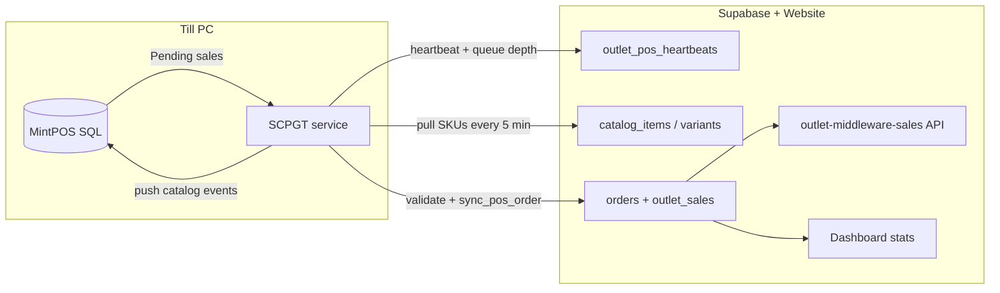

# Multi-outlet POS sync — architecture and runbook

This document is the **single source of truth** for how MintPOS, SCPGT middleware, Supabase, the website API, and the dashboard stay aligned across **all outlets** (Till 1, Till 2, Quick Corner, and future POS outlets).

---

## One middleware PC = one outlet

Each outlet with a till runs its own **SCPGT** Windows service configured with:

```json
"Outlet": { "Id": "<outlet-uuid-from-supabase>" }
```

There is no shared multi-outlet middleware process. Scaling to a new POS outlet means:

1. Create outlet row in Supabase (`has_pos_middleware = true`)
2. Link `outlet_warehouses`
3. Install SCPGT on the till PC with that outlet UUID
4. Assign products via **Outlet Catalog Access** (Android allowlist) and ensure **SKUs match** `MenuItem.Code` on MintPOS
5. Export sales via `/api/outlet-middleware-sales?outletId=<uuid>` (any POS outlet)

---

## Data flow (every poll cycle, default 60s)



### Heartbeat (liveness + sync health)

Each cycle SCPGT sends:

- `outlet_id`, `host_name`, `middleware_version`
- `pending_sales_count` — MintPOS sales still `Pending`
- `last_sync_error` — last failure in this process
- `last_sale_uploaded_at` — last successful upload

**Online** = heartbeat within 10 minutes.  
**Sync healthy** = online AND `pending_sales_count = 0` AND no `last_sync_error`.

Monitor: **Warehouse Backoffice → Middleware Connectivity**

### Catalog matching (heartbeat loop, not a separate job)

On the same poll cycle (SKU pull every **5 minutes** by default):

1. SCPGT reads `MenuItem.Code` + `ModifierFlavour.Name2` from MintPOS
2. Calls `sync_pos_catalog_from_middleware` → updates Supabase SKUs / names
3. Website **Outlet Catalog Access** controls which items appear on the Android ordering app per outlet
4. **Sales mapping** uses `resolve_catalog_by_sku` / `resolve_catalog_for_outlet` — `MenuItem.Code` must equal `catalog_items.sku`

Unmapped POS SKUs → `no_mappable_items` → sale stays **Pending** in MintPOS → visible as **pending_sales_count** on heartbeat.

---

## Why gaps happened (Jul 1 Quick Corner)

| Symptom | Root cause | Permanent fix |
|--------|------------|---------------|
| Missing `shift` on 246 bills | Orders are **write-once**; old uploads had no shift in payload; reconcile path skipped re-upload | `patch_pos_order_payload` + SCPGT patches on reconcile |
| Night/Midnight looked wrong in SQL | Query read empty `raw_payload.shift` | Backfill script `15_backfill_shift_jul1.sql` + ongoing patch |
| 554 vs 569 bills | MintPOS `Sale.Date` vs Supabase `sold_at` UTC window | Dashboard uses EAT business dates; compare with `Sale.Date` for QC |
| Unit gap (1671 vs 1284) | Unmapped lines + date window; not all `Saledetails` become `outlet_sales` | Fix SKUs via catalog pull; monitor pending queue + pos-sync-failures |

**Day Shift Donner matched exactly** — the pipeline works when SKUs are mapped and payload is complete.

---

## Deploy order (fix current data + permanent behavior)

### A) Supabase SQL (once per environment)

Run in order:

1. `supabase/scripts/multi-outlet-sync/14_permanent_sync_fix.sql`
2. `supabase/scripts/multi-outlet-sync/14b_patch_sync_pos_order_early_return.sql`
3. `supabase/scripts/quick-corner-reconcile/15_backfill_shift_jul1.sql` (Quick Corner Jul 1 shift only)

Verify:

```sql
SELECT public.get_outlet_sync_health('a406fede-7aab-4473-8e9f-ff645267466f'::uuid);
```

### B) Redeploy SCPGT on **every** outlet PC

Rebuild `pos-sync-service` and replace `SCPGT.exe` on Till 1, Till 2, Quick Corner.

Changes:

- Heartbeat includes pending queue depth
- **Reconcile path patches** order metadata (`shift`, payments, etc.) via `patch_pos_order_payload`
- Catalog SKU pull default **5 min** (was 30)

### C) Website

Deploy Afterten / Website Portal so **Middleware Connectivity** shows pending sales and sync errors.

---

## Multi-outlet sales API

| Outlet | UUID | Export URL |
|--------|------|------------|
| Till 1 | `648e949d-8648-4c43-80d4-f08feb7bdd04` | `/api/outlet-middleware-sales/tills` or `?outletId=` |
| Till 2 | `a655b0a1-a37a-43d6-aa55-7f97377b2660` | same `tills` route |
| Quick Corner | `a406fede-7aab-4473-8e9f-ff645267466f` | `/api/outlet-middleware-sales/quick-corner` or `?outletId=` |

**Any POS outlet:**

```
GET /api/outlet-middleware-sales?outletId=<uuid>&since=...&until=...
```

---

## Ongoing operations checklist

| Check | Where |
|-------|--------|
| Middleware online | Middleware Connectivity |
| Pending sales = 0 | Same table column |
| Mapping failures | POS Sync Failures |
| SKU drift | Portal/Mintpos Sync → Import from till |
| Product visible on outlet app | Outlet Catalog Access |
| Dashboard totals | EAT date range; filter by outlet |

---

## What we did **not** auto-fix (by design)

- **Line-level qty drift** on already-uploaded bills (would need a dangerous re-sync). New sales upload correctly when SKUs map.
- **Historical bills never exported** from MintPOS (~46 QC tail). Re-queue in MintPOS only if those bills must appear in Supabase.

For line-level investigation, compare per `pos_bill_id` in MintPOS `Saledetails` vs Supabase `outlet_sales` for that `source_event_id`.
