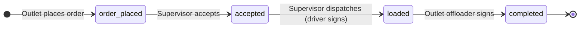

# Afterten Orders App — User Guide

This guide explains how the **Afterten Orders** mobile app works from a day-to-day user perspective: placing orders, supervisor review, warehouse preparation, driver handover, outlet delivery, damages, and what happens when an order is completed.

It covers the flow **up to and including** the moment the outlet offloader signs and the order moves to **Completed**.

---

## Who uses the app

| Role | What they do |
|------|----------------|
| **Outlet staff** | Place orders, track pending deliveries, sign when stock arrives, report damages |
| **Supervisor / warehouse admin** | Review and accept orders, run preparation lists, dispatch to drivers, approve damage reports |

Each outlet logs in with its own account. Supervisors see a separate home screen with warehouse tools. Some accounts may have both roles; the app shows the right buttons for each.

---

## Home screens

### Outlet home

From the main screen you can open:

- **Create New Order** — browse the catalog and place a transfer order to the hub
- **Pending Orders** — orders and damage reports still in progress
- **Completed Orders** — finished orders and damage reports (with PDF download)
- **Damages** — submit a new damage report

### Supervisor home

Supervisors see:

- **Outlet Orders** — new orders waiting for review (`Order Placed`)
- **Driver Handover** — accepted orders and accepted damage reports ready to load onto a truck
- **Damages** — damage reports waiting for supervisor approval
- **Completed Orders** — all completed orders and damage reports across outlets (if you have access)

---

## Order lifecycle (overview)

Every transfer order moves through four main statuses:

| Status in app | Meaning |
|---------------|---------|
| **Order Placed** / **Pending Approval** | Outlet submitted the order; supervisor has not accepted yet |
| **Order Updated** | Supervisor changed quantities or variants while still pending |
| **Order Accepted** | Supervisor accepted; warehouse is preparing the order |
| **Loaded & On Route** | Stock is on the truck; outlet can start delivery sign-off |
| **Completed** | Outlet offloader signed; order is closed |

---

## Stage 1 — Outlet places an order

**Where:** Create New Order → review → sign

### What you do

1. Tap **Create New Order**.
2. Browse or search the product catalog. Tap a product to set quantity; products with variants open a variant picker.
3. Some products add **companion lines** automatically (for example lids with cups, bread with shawarma trays). You do not need to add these yourself.
4. When finished, go to the **order review** screen. Check date, time, outlet name, line items, quantities, units, and total.
5. Enter your **employee name** (the app formats it with capital letters).
6. Open the signature pad, draw your signature in one continuous stroke, and tap **Place order**.

### What happens behind the scenes

- The order is saved with status **Order Placed** (`order_placed`).
- Your employee name, signature, and timestamp are stored.
- An order number is assigned for your outlet.
- **Supervisors receive a push notification** that a new order was placed (when push is enabled on their device).

### What you see next

- The order appears in **Pending Orders** with status **Pending Approval**.
- You can open it to view details, but you cannot change quantities yourself at this stage.

---

## Stage 2 — Supervisor reviews and accepts

**Where:** Supervisor → Outlet Orders → open order

### What the supervisor does

1. Open **Outlet Orders** (also called the Supervisor Queue).
2. Find the order — grouped by outlet, searchable by order number, employee name, or product.
3. Open the order detail. While status is still **Order Placed**, the supervisor can:
   - **Change quantities** on existing lines (using the same step rules as the outlet, e.g. cases of 10 or 20)
   - **Replace a variant** with another variant of the same base product (tap the line → choose variant). If the target variant already exists, quantities merge automatically
   - **Save changes** before accepting
4. Tap **Accept order**.

The supervisor **cannot** add new products or delete lines — only adjust what the outlet ordered.

### What happens behind the scenes

- Status changes to **Accepted**.
- Supervisor name and accept time are recorded.
- If quantities were edited, the order is marked **Updated by supervisor**.
- **The outlet receives a push notification** that the order was accepted.
- A **WhatsApp message** is sent to the warehouse group with the accepted order summary (product lines and quantities).

### What the outlet sees

- **Pending Orders** shows **Order Accepted** (or **Order Updated** if the supervisor changed something while it was still pending).
- The order is read-only for the outlet until it is loaded.

### Optional — Preparation screen (aggregation)

After accepting, the supervisor can open **Preparation** from the order detail. This is a **warehouse-wide checklist for the day**, not just one outlet.

**What it shows:**

- All **accepted** orders placed on the **same calendar date** across every outlet the supervisor can see
- Products **aggregated** into one list: total quantity per product in **supervisor units** (e.g. packets, kg)
- How many outlets ordered each product (shown when more than one outlet needs it)
- Live tick boxes — when one supervisor ticks a product as prepared, **all supervisors viewing the same date see the update**

**What it does *not* do:**

- It does not change order status
- It does not block driver handover
- It is a coordination tool so the warehouse knows what to pick and pack for the day

Example: if Outlet A ordered 20 kg shawarma and Outlet B ordered 40 kg, Preparation shows **60 kg shawarma** with “(2 outlets)”.

---

## Stage 3 — Driver handover (supervisor dispatches)

**Where:** Supervisor → Driver Handover → select order → load checklist → select driver → driver signature

### What the supervisor does

1. Open **Driver Handover**. This list shows:
   - All orders with status **Accepted**
   - All **accepted** damage reports ready for pickup (see Damages section below)
2. Tap an order for an outlet.
3. **Load checklist** — tick each product line as it is loaded onto the truck (supervisor view of quantities).
4. Tap **Continue to driver selection**.
5. Choose the **driver name** from the preset list.
6. The driver (or supervisor on their behalf) draws a **driver signature** on the pad.
7. Tap **Dispatch order**.

### What happens behind the scenes

- Status changes to **Loaded** (`loaded`).
- Driver name, signature, and load timestamp are stored.
- **The outlet receives a push notification** that the order is on the way.

### What the outlet sees

- **Pending Orders** shows **Loaded & On Route**.
- Opening the order shows a **Start delivery checklist** button.

---

## Stage 4 — Outlet receives stock (offloader signs)

**Where:** Pending Orders → open loaded order → delivery checklist → offloader signature

### What the outlet does

1. When the truck arrives, open the order from **Pending Orders**.
2. Tap **Start delivery checklist**.
3. Tick each product as it is offloaded and received at the outlet.
4. Tap **Continue to offloader signature**.
5. Enter the **offloader name** (person receiving the stock).
6. Draw the **offloader signature**.
7. Tap **Finalize delivery**.

### What happens behind the scenes

- Status changes to **Completed**.
- Offloader name, signature, and completion timestamp are stored.
- **Supervisors receive a push notification** that the order was received and signed.
- The order leaves **Pending Orders** and appears under **Completed Orders**.

### What you can do after completion

- Open **Completed Orders**, tap the order, and **download a PDF** with the full order summary and all signatures (employee, driver, offloader).
- The order cannot be edited or re-opened in the app.

---

## Damage reports

Damages are a **parallel flow** for stock that arrived damaged or was found damaged at the outlet. They use the same handover and delivery pattern as orders but start with a photo and supervisor approval.

### Damage statuses

| Status | Meaning |
|--------|---------|
| **Awaiting supervisor approval** | Outlet submitted report + photo; warehouse has not reviewed |
| **Accepted** | Supervisor approved; ready for driver pickup |
| **Loaded & On Route** | Driver signed at warehouse; replacement stock is on the truck |
| **Completed** | Outlet offloader signed for the damage delivery |
| **Declined** | Supervisor rejected the report; outlet must submit again if needed |

---

### Stage D1 — Outlet submits a damage report

**Where:** Damages (from home)

### What you do

1. Tap **Damages** on the home screen.
2. Search and add damaged products with quantities (same catalog as orders; damage quantities use the damage unit of measure).
3. Take a **photo of the damaged products** (required).
4. Enter **your name** as reporter.
5. Tap **Submit damage report**.

### What happens

- Report is created with status **Awaiting supervisor approval**.
- Photo is uploaded and stored with the report.
- **Supervisors receive a push notification** that a damage image was uploaded.
- The report appears in the outlet’s **Pending Orders** list (tagged as **Damage report**) and in the supervisor’s **Damages** queue.

---

### Stage D2 — Supervisor reviews

**Where:** Supervisor → Damages → open report

### What the supervisor does

1. Open the damage report.
2. Review the photo, product lines, and quantities.
3. Tap **Accept** or **Decline**.

### If accepted

- Status becomes **Accepted**.
- Warehouse is notified via **WhatsApp** (message includes report details and photo link).
- The report moves to **Driver Handover** alongside accepted orders.
- Outlet sees it in **Pending Orders** as accepted, waiting for pickup.

### If declined

- Status becomes **Declined**.
- The outlet is told to submit a new report if still required.
- The report does not continue to driver handover.

---

### Stage D3 — Driver handover for damages

**Where:** Supervisor → Driver Handover → damage report row

Same steps as a normal order:

1. Load checklist (tick products loaded)
2. Select driver
3. Driver signature
4. Dispatch

Status becomes **Loaded & On Route**. Outlet can complete delivery when the truck arrives.

---

### Stage D4 — Outlet completes damage delivery

**Where:** Pending Orders → damage report → delivery checklist → offloader signature

Same as a normal order:

1. Delivery checklist — tick products received
2. Offloader name + signature
3. **Finalize delivery**

Status becomes **Completed**. PDF available from **Completed Orders**.

---

## Pending Orders — combined view

The outlet **Pending Orders** screen merges:

- Transfer orders in statuses: **Order Placed**, **Order Accepted**, **Loaded**
- Damage reports in statuses: **Awaiting approval**, **Accepted**, **Loaded**

Each row is labelled so you can tell an order from a damage report. Tap to open the right detail or delivery flow.

---

## Completed Orders

Shows all **completed** transfer orders and **completed** damage reports.

- **Outlet users** see only their outlet.
- **Supervisors** see all outlets they have access to.
- Each row has a **PDF** button to generate and download the signed document on the device.

---

## Signatures — rules of thumb

| Step | Who signs | Where |
|------|-----------|--------|
| Place order | Outlet employee | Order review screen |
| Dispatch | Driver | Supervisor phone at warehouse |
| Receive delivery | Offloader | Outlet phone when stock arrives |
| Damage dispatch | Driver | Supervisor phone (same as orders) |
| Damage receive | Offloader | Outlet phone |

Signatures must be drawn in **one continuous stroke** (minimum length enforced). Typed signatures are not used.

---

## Notifications (when enabled)

| Event | Who is notified |
|-------|-----------------|
| Order placed | Supervisors |
| Order accepted | Outlet |
| Order loaded / dispatched | Outlet |
| Order completed (offloader signed) | Supervisors |
| Damage report submitted | Supervisors |

Notifications require the native app build with push enabled; they do not work in Expo Go alone.

---

## Quick reference — “What happens at each stage?”

### Transfer orders

| Stage | Who acts | Status after | Outlet sees | Supervisor sees |
|-------|----------|--------------|-------------|-----------------|
| Place order | Outlet | Order Placed | Pending — Pending Approval | Outlet Orders queue |
| Accept (+ optional edits) | Supervisor | Accepted | Pending — Order Accepted | Driver Handover + Preparation |
| Dispatch | Supervisor + driver sign | Loaded | Pending — Loaded & On Route | Leaves handover queue |
| Offloader sign | Outlet | **Completed** | Completed Orders + PDF | Completed Orders + PDF |

### Damage reports

| Stage | Who acts | Status after | Outlet sees | Supervisor sees |
|-------|----------|--------------|-------------|-----------------|
| Submit + photo | Outlet | Awaiting approval | Pending — damage tag | Damages queue |
| Accept / Decline | Supervisor | Accepted or Declined | Pending or must resubmit | Handover (if accepted) |
| Dispatch | Supervisor + driver sign | Loaded | Pending — on route | Leaves handover |
| Offloader sign | Outlet | **Completed** | Completed + PDF | Completed + PDF |

---

## Preparation aggregation — summary

- **Purpose:** Help the warehouse prepare **all accepted orders for one day** in one checklist.
- **Scope:** Same calendar date as the order you opened; includes every accepted order from every outlet you can supervise.
- **Aggregation:** Quantities for the same product are **added together** in supervisor units.
- **Shared ticks:** Checkmarks sync live between supervisors — useful when more than one person is picking.
- **Not a status step:** Finishing preparation does not complete or dispatch orders; those are separate actions in Driver Handover.

---

## Related documentation

- [orders-app-operations.md](./orders-app-operations.md) — stock control and ordering limits (Operation A / B)
- [android-orders-app-flow.md](./android-orders-app-flow.md) — technical build specification (developers)

---

*Last updated: August 2026 — reflects the Expo orders app and Firebase backend (`afterten-portal-system`).*
