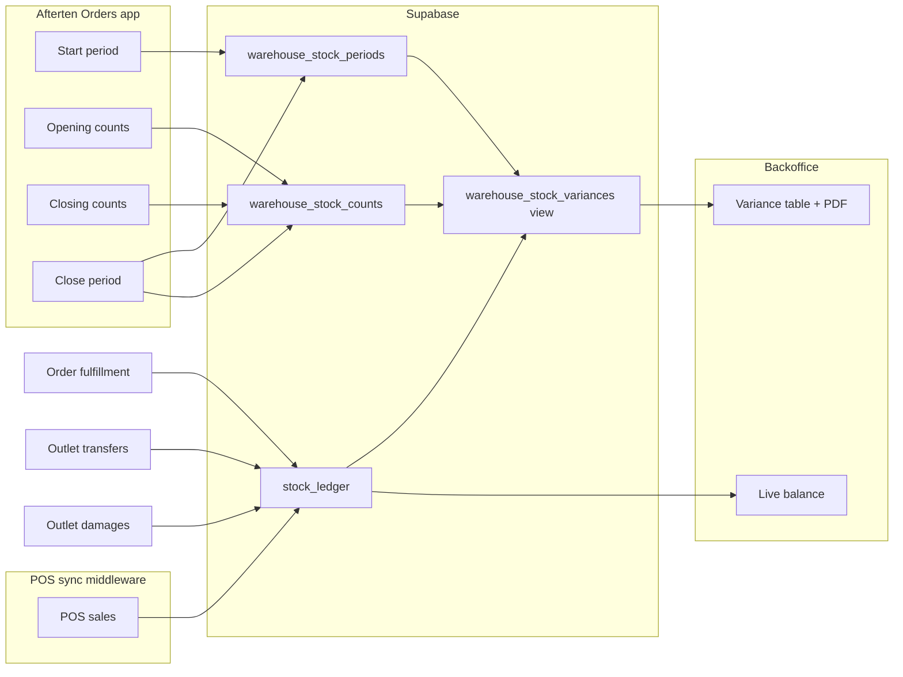

# Outlet warehouse stocktakes & variance

Outlet warehouse stocktakes tie together the **Afterten Orders** Android app, **Warehouse Backoffice** (`/Warehouse_Backoffice/stocktakes`), and **POS sync middleware** on each outlet PC.

## Flow



## Variance formula

Ledger deltas are **signed** (transfers in are positive, sales and damages are negative):

| Term | Source |
|------|--------|
| Opening | `warehouse_stock_counts` where `kind = 'opening'` |
| Order transfers | `stock_ledger` where `reason = 'warehouse_transfer'` |
| Damages | `stock_ledger` where `reason = 'damage'` |
| Sales | `stock_ledger` where `reason = 'outlet_sale'` (outlet sales warehouses only) |

```
Expected = Opening + Transfers + Damages + Sales
Variance = Expected − Closing
Variance value = unit cost × Variance qty
```

Positive variance = **short** vs book (expected more than physically counted).

## Android app (Afterten Orders)

Home → **Outlet Stocktake**:

1. **Start period** — calls `start_stock_period`; seeds opening from previous closing when one exists.
2. **Opening / Closing** chips — tap items to record counts via `record_stock_count`.
3. **Close period** — requires at least one closing count; calls `close_stock_period`.

Order receipts use **Receive Orders** (ledger `warehouse_transfer`). They appear in variance automatically — no separate stocktake entry.

## Backoffice

`/Warehouse_Backoffice/stocktakes`:

- **Live balance** — `v_outlet_warehouse_ledger_balances` (30s poll).
- **Periods** — opening/closing counts from the app; **PDF** on closed periods.
- **Variance report** — `/api/stocktake-variance` when a closed period is selected.

When a period closes, the next period opens with opening stock = previous closing snapshot.

## Middleware (POS sync)

Migrations `20260616200000_outlet_stocktake_variance.sql` and `20260616210000_outlet_stocktake_pos_sync.sql`:

- Outlet app users (`outlets.auth_user_id`) may operate stocktakes on their warehouse.
- `start_stock_period` → `set_pos_sync_opening_for_warehouse` (middleware only syncs sales after period open).
- `close_stock_period` → `set_pos_sync_cutoff_for_warehouse` then auto-starts the next period (which sets a new opening).

Middleware reads `pos_sync_opening` / `pos_sync_cutoff` from `counter_values` per outlet.

## Apply migrations

1. `20260616200000_outlet_stocktake_variance.sql`
2. `20260616210000_outlet_stocktake_pos_sync.sql`
3. `20260617000000_android_orders_flow.sql`
4. `20260617100000_middleware_pos_sync_alignment.sql` — POS sync window RPCs + `uses_orders_app` deduction guard

## Key RPCs

| RPC | Purpose |
|-----|---------|
| `start_stock_period` | Open period; roll forward closing → opening |
| `record_stock_count` | Save opening/closing qty |
| `close_stock_period` | Finalize closing, POS cutoff, auto-open next |
| `set_pos_sync_opening_for_warehouse` | Middleware sales window start |
| `set_pos_sync_cutoff_for_warehouse` | Middleware sales window end |
