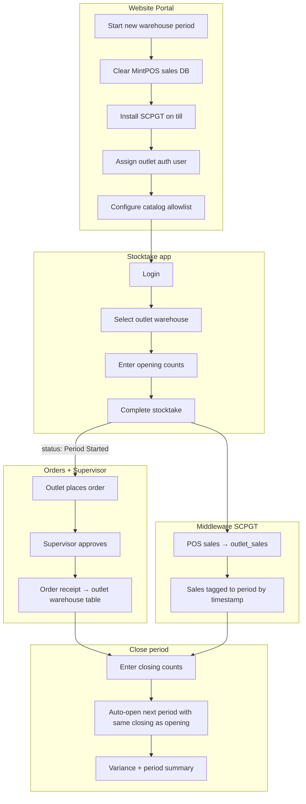

# Afterten Stocktake Portal — system architecture

This document describes how the **Stocktake Android app**, **Afterten Website Portal**, **Afterten Orders app**, **Supervisor app**, and **SCPGT middleware** work together for outlet warehouse periods, orders, sales, and variance.

Use this as the reference when building order creation, driver handover, outlet receiving, and signatures in Afterten Orders.

---

## Roles and apps

| App | Users | Purpose |
|-----|-------|---------|
| **Afterten Website Portal** | Backoffice staff | Configure outlets, catalog allowlists, period corrections, yield rules, live balances, variance PDFs |
| **Stocktake Android app** | Outlet stock operators | Opening/closing physical counts per outlet warehouse |
| **Afterten Orders Android app** | Outlet staff | Place orders to warehouse; receive approved deliveries |
| **Supervisor Android app** | Supervisors | Approve orders before they land at outlet warehouse |
| **SCPGT.exe** (middleware) | Runs on MintPOS PC | Sync POS sales into Supabase within the active stock period window |

---

## End-to-end lifecycle (new outlet period)

### Step-by-step

1. **Backoffice** opens a new period for the outlet warehouse (or the Stocktake app starts it on first opening count).
2. **MintPOS sales** are cleared on the till so the new period starts clean.
3. **SCPGT.exe** is installed/configured on the MintPOS machine (`pos_sync_opening` / `pos_sync_cutoff` counters drive the sales window).
4. **Portal → Outlet Catalog Access**: link Supabase Auth user to outlet; tick products/variants allowed in **Orders app** and **Stocktake app**.
5. **Stocktake app**: operator logs in, selects outlet warehouse, enters all opening quantities, taps **Complete Stocktake**.
   - Writes `warehouse_stock_counts` (`kind = opening`).
   - Calls `start_stock_period` if none open.
   - Sets `outlet_warehouse_period_summaries.status = period_started`.
   - Sets POS sync opening via `set_pos_sync_opening_for_warehouse`.
6. **Orders app**: outlet user signs in (same or different auth user per outlet assignment), sees **only allowlisted** products/variants, creates order.
7. **Supervisor app**: approves order → lines copied to **`outlet_warehouse_order_receipts`** and ledger `warehouse_transfer` (existing flow).
8. **Middleware**: continuously posts sales to `outlet_sales` / `stock_ledger`. Each sale is assigned to the period where `occurred_at` falls between period opening and closing timestamps (second-level precision).
9. **Second Stocktake visit** (same period): app detects open period with opening done → **closing count** mode.
10. **Complete closing**: writes closing counts, `close_stock_period`, rolls opening of next period = previous closing, updates summaries and **`outlet_warehouse_period_variances`**.

---

## Three outlet warehouse tables (logical model)

All rows are scoped by `outlet_id` + `warehouse_id`. Sales remain in the existing **`outlet_sales`** table.

| Table | Purpose |
|-------|---------|
| **`outlet_warehouse_order_receipts`** | Approved orders received at the outlet warehouse (one row per order per warehouse) |
| **`outlet_warehouse_period_summaries`** | Per period: total orders sent, total sales, opening/closing timestamps, status (`period_started` / `period_closed`) |
| **`outlet_warehouse_period_variances`** | Per product/variant per period: opening, closing, orders, sales, damages, expected, variance |

Portal **Outlet Live Balances** reads ledger + order receipts to show “sent vs consumed” per outlet as soon as opening stock exists.

---

## Catalog visibility (replaces global “Show in outlet orders”)

| Old | New |
|-----|-----|
| `catalog_items.outlet_order_visible` on product form | **Removed from product UI** |
| Same flag for all outlets | **`outlet_catalog_allowlist`** per outlet |

Portal page: **`/Warehouse_Backoffice/outlets/catalog-access`**

- Select outlet
- Link / display Supabase Auth user (`outlet_auth_assignments`)
- Checkbox grid: products and variants → `allow_orders`, `allow_stocktake`

Android apps filter catalog through allowlist (Orders) or stocktake allowlist (Stocktake app).

---

## Stocktake app UX

Theme: **red, black, gold, purple** on **white** backgrounds.

| Screen | Behaviour |
|--------|-----------|
| Login | Email/password + Google (Supabase OAuth) |
| Welcome | “Welcome to the Afterten Stocktake Portal” |
| Outlet picker | Lists outlet warehouses (`show_in_stocktake = true`) |
| Count grid | 3 columns; image, UOM, qty field |
| Variants | Tap product → scrollable dialog with variant rows + **×** close |
| Complete | Saves all counts; opening vs closing decided by period state |

**Period logic**

| State | User action |
|-------|-------------|
| No open period | Complete → **opening** stock + start period |
| Open period, no closing yet | Complete → **closing** stock + close period + auto-open next |
| Next period | Opening pre-filled from previous closing (middleware keeps running) |

---

## Portal source of truth for opening/closing

Page: **`/Warehouse_Backoffice/outlets/stocktake-corrections`**

- Edit opening/closing qty per item/variant for a closed or open period.
- Changes write `portal_opening_override` / `portal_closing_override` on variance rows.
- **Does not** rewrite sales or re-split periods.
- Variance PDFs use portal overrides when set.

---

## Unified fulfillment recipes (POS deduct + reporting)

Page: **`/Warehouse_Backoffice/pos-sale-deductions`** (nav: **Fulfillment recipes**)

Three layers — **only the first two touch stock**:

| Layer | Trigger | Affects stock? | What it does |
|-------|---------|----------------|--------------|
| **Orders** | Supervisor approve → `record_order_fulfillment` | **Yes** | Credits **ingredients** at outlet in **order UOM** (kg, plastics, g, pieces) |
| **POS sales** | Middleware → `apply_pos_sale_deduction_rules` | **Yes** | Deducts configured qty per sale (e.g. 166 g chicken + 1 bread per shawarma) |
| **Finished equivalent** | Same approve → `record_outlet_warehouse_order_receipt` | **No** | Stores how many shawarmas the order *represents* for reports only |

**Stocktake** counts **ingredients** (same UOM as orders), not finished products.

Example recipe on **`outlet_pos_deduction_rules`**:

- 1 shawarma sold → deduct **166 g** chicken + **1** bread (POS)
- Order: **5 kg** chicken + **2 plastics** bread (30 per plastic = 60 bread)
- Stock credited at outlet: **5 kg chicken + 2 plastics bread** (unchanged)
- Report only: `5000 g / 166` and `60 / 1` → **30 shawarmas sent**

Configure per deduct line:

- **Qty per sale** — in the deduct item&apos;s catalog UOM (`consumption_unit` / How its consumed)
- **Pack products** — set units per pack on the product form when UOM is plastic/case

Apply SQL scripts **in order**:

1. `supabase/scripts/outlet_stocktake_portal_system.sql`
2. `supabase/scripts/outlet_pos_deduction_rules.sql`
3. `supabase/scripts/outlet_fulfillment_unified.sql`

---

## Middleware period automation

SCPGT reads `counter_values`:

| Key | Set when |
|-----|----------|
| `pos_sync_opening` | Period started / opening stocktake completed |
| `pos_sync_cutoff` | Period closed |

Sales with `occurred_at`:

- **≥ opening** and **< cutoff** (or no cutoff if period open) → current period
- Assigned when ingesting via `sync_pos_order` / period summary refresh

A **stocktake-aware middleware build** (copy of SCPGT with period feature flag) can auto-call `start_stock_period` / `close_stock_period` when configured; the Stocktake app remains the primary trigger for opening/closing counts.

---

## Order flow stages (for Afterten Orders build-out)

| Stage | Actor | System |
|-------|-------|--------|
| 1. Draft | Outlet | Orders app cart |
| 2. Placed | Outlet | `place_order` → supervisor queue |
| 3. Approved | Supervisor | `supervisor_approve_order` |
| 4. Warehouse receipt | System | `outlet_warehouse_order_receipts` + ledger transfer |
| 5. Loaded / dispatched | Driver | Order status RPCs |
| 6. Received | Outlet | Receive Orders + signature |
| 7. POS sale | MintPOS → middleware | `outlet_sales` in active period |
| 8. Variance | Backoffice | Period close + PDF |

---

## Key RPCs and APIs

| RPC / API | Used by |
|-----------|---------|
| `start_stock_period` | Stocktake app, middleware |
| `record_stock_count` | Stocktake app, portal corrections |
| `close_stock_period` | Stocktake app |
| `set_pos_sync_opening_for_warehouse` | Period start |
| `set_pos_sync_cutoff_for_warehouse` | Period close |
| `sync_pos_order` | SCPGT middleware |
| `GET /api/outlet-catalog-access` | Portal allowlist UI |
| `GET /api/stocktake-variance` | Portal variance PDF |
| `GET /api/warehouse-periods` | Portal period picker |

---

## SQL to apply

Run in Supabase (in order):

1. Existing stocktake migrations (if not applied): `20260616200000_outlet_stocktake_variance.sql`, etc.
2. **`supabase/scripts/outlet_stocktake_portal_system.sql`** — allowlist, auth assignments, three outlet tables, yield rules, helper RPCs.

---

## Build targets

| Component | Path |
|-----------|------|
| Stocktake APK | `Afterten Orders/stocktake-app/` |
| Shared library | `Shared/` |
| Portal pages | `Afterten Website Portal/src/app/Warehouse_Backoffice/outlets/` |
| Middleware | `pos-sync-service/` (period-aware SCPGT) |
